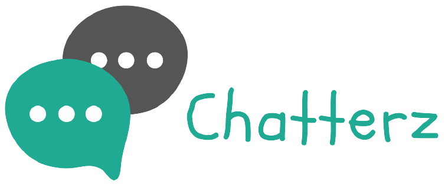

<h1 align="center">QuikPantry</h1></br>

<p align="center">
:shopping_cart:  A JAM stack PWA, grocery shop web app built with React, TypeScript, JWT, Next.js and MongoDB. :apple:
</p>
<br>

<p align="center">
  <a href="#"></a>
  <a href="#"></a>
  <a href="https://github.com/k4u5h4L"></a>
  <a href="#"></a>
  <a href="#"></a>
  <a href="#"></a>
</p>

<br>
<p align="center">
</img>
</p><br>

## Technologies used:

-   React as the UI library.

-   Next.js for the as the server.

-   MOngoDB, and Mongoose as the ODM.

-   NextAuth as the authentication backend with passwordless logins.

## To run:

-   Clone and cd into the repo.

```
git clone https://github.com/k4u5h4L/QuikPantry.git && cd QuikPantry
```

-   Install the dependencies

```
yarn install
```

-   Create a new file called `.env.local` and fill in variables and keys from different providers.

<!-- -   Run migrations for the DB (if not present).

```
npx prisma migrate dev --preview-feature
npx prisma generate
``` -->

-   Now with all the API keys and media loaded, run development server.

```
yarn dev
```

-   Now visit the location [localhost:3000](http://localhost:3000) to check out the site!

## Note:

-   This project is for learning purposes only.

<!-- -   Any contribution is welcome. You may fork the repo and issue a PR. -->
